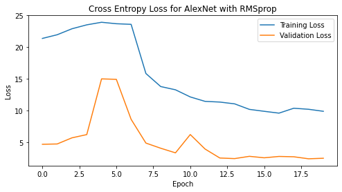

# CSE 590G1 Final Project: Transfer Leanring Applied to Rice Image Classification

## Project Description

Rice is the most widely consumed staple food for over half of the world's population and is one of the most produced agricultural commodities worldwide. Rice consists of numerous genetic varieties. These varieties are separated from each other due to some of their features such a texture, shape, color. Using these visual features, it is possible to classify and evaluate the quality of rice grains. Using the [Rice Image Dataset](https://www.kaggle.com/datasets/muratkokludataset/rice-image-dataset) from Kaggle, I aim to explore various transfer learning approaches with neural network models to see how they generalize to classifying rice varieties. The specific neural network models that I apply transfer learning (using their PyTorch implementations) to are:  

> [**AlexNet**](https://arxiv.org/abs/1404.5997) (a classic model)  
[**ResNet18**](https://arxiv.org/abs/1512.03385) (a classic model)  
[**SqueezeNet**](https://arxiv.org/abs/1602.07360) (a more recent-ish model)  

I also use three different optimization strategies ([SGD](https://en.wikipedia.org/wiki/Stochastic_gradient_descent), [Adadelta](https://arxiv.org/abs/1212.5701), [RMSprop](http://www.cs.toronto.edu/~tijmen/csc321/slides/lecture_slides_lec6.pdf)) for each model to see how they impact model performance for transfer learning.

## Dataset

The [Rice Image Dataset](https://www.kaggle.com/datasets/muratkokludataset/rice-image-dataset" target="_blank) from Kaggle is provided by [Murat Koklu](https://www.muratkoklu.com/en/home/). The image dataset consists of 75,000 images of 5 rice varieties(often grown in Turkey). There are 15,000 images for each variety in the dataset. Each image consists of a single grain of rice of the appropriate variety, and is 250 x 250 pixels in size. Shown below are examples of a single image containing a single grain of each rice variety:

| Arborio | Basmati | Ipsala | Jasmine |Karacadag |
| :---:   | :---:   | :---:  | :---:   | :---:    |
|  |  |  |  |  |

## Data Preprocessing

The data was pre-labeled appropriately, and so, I did not have to manually label or re-label the data. When loading in the images, I resize them to 256x256x3 and then take a center crop of the image of size 224x224x3, which is the input size for all three neural network models being trained. Then, I normalize the images. I then split the data into training, validation and testing sets using an 70:15:15 split (52,500 training images, 11,250 validation images, and 11,250 testing images). The code for data preprocessing (and the rest of the code for the experiments) can be found in our GitHub repository. 

## Experiment

The three neural network models I apply transfer learning to were all trained on the ImageNet dataset. I experiment to see how well the "knowledge" learned by these models on the ImageNet dataset can be translated to classify these rice varieties. The models' PyTorch implementations are loaded using the Torchvision models subpackage. The optimizers' PyTorch implementations are loaded using the Torch optim subpackage. I use cross entropy loss as the loss criterion during training.

The models are trained for 20 epochs. After each training epoch, the accuracy of the model on the validation set is computed. The epoch at which the model exhibits the highest validation accuracy is used to save the best-performing model. After training, the accuracy of the model on the testing set is computed.

## Models

For all the models, since I want to take advantage of what was already learned by training on the ImageNet dataset, I load pretrained versions of the models, but I only finetune the weights on the output layers that I change to match the dimensions of the number of classes in our dataset. The architectures for each model are available in the source code linked in the title of each model below. 

### [**AlexNet**](https://pytorch.org/hub/pytorch_vision_alexnet/)

AlexNet is a landmark model based on CNN architecture. It won the ImageNet large-scale visual recognition challenge in 2012. The model was proposed by Alex Krizhevsky and his colleagues. I load the pretrained version of this model and then replace the fully connected output layer with a newly initialized fully connected layer that has 5 output nodes (for the 5 rice varieties in the dataset). I then initialize the optimizer such that only the parameters of this newly initialized fully connected layer are optimized so that I don't finetune the weights of the previous layers that have been loaded from pretraining. AlexNet has 8 layers.

### [**ResNet18**](https://pytorch.org/vision/main/models/generated/torchvision.models.resnet18.html)

[ResNet]((https://pytorch.org/hub/pytorch_vision_resnet/)) is another landmark CNN model that won the ImageNet challenge in 2015. It is the most cited neural network of the 21st century. The model was proposed by Kaiming He and his colleagues. I load the pretrained version of this model and then replace the fully connected output layer with a newly initialized fully connected layer that has 5 output nodes (for the 5 rice varieties in the dataset). I then initialize the optimizer such that only the parameters of this newly initialized fully connected layer are optimized so that I don't finetune the weights of the previous layers that have been loaded from pretraining. There are many variants of ResNet such as ResNet18, ResNet34, ResNet50 and so on, but I chose to use the ResNet18 model as it has 18 layers and is the most comparable to AlexNet in terms of number of layers.

### [**SqueezeNet**](https://pytorch.org/hub/pytorch_vision_squeezenet/)

SqueezeNet is a smaller CNN model that was designed as a more compact replacement for AlexNet. It has almost 50x fewer parameters, performs 3x faster and achieves comparable accuracy to AlexNet on the ImageNet dataset. SqueezeNet was developed by researchers at DeepScale, Stanford University, and the University of California, Berkeley. It was proposed in a paper called [SqueezeNet: AlexNet-level accuracy with 50x fewer parameters and < 0.5MB model size](https://arxiv.org/abs/1602.07360). I load the pretrained version of this model and then replace the last convolutional layer with a newly initialized convolutional layer that has 5 output nodes (for the 5 rice varieties in the dataset). I then initialize the optimizer such that only the parameters of this newly initialized convolutional layer are optimized so that I don't finetune the weights of the previous layers that have been loaded from pretraining.

## Optimizers

For all the optimizers, I used the same initial learning rate of 0.01. For SGD and RMSprop, I also use a momentum value of 0.9 as is standard practice.

### [**SGD**](https://pytorch.org/docs/stable/generated/torch.optim.SGD.html)

In contrast to regular gradient descent, mini-batch stochastic gradient descent (SGD) performs parameter updates for each batch of training examples rather than the entire training set. This reduces the variance of the parameter updates and generally leads to the best performance out of gradient descent variants.

### [**Adadelta**](https://pytorch.org/docs/stable/generated/torch.optim.Adadelta.html)

Adadelta is an extension of Adagrad. Adagrad tries to lower the learning rate for parameters associated with frequently occurring features and larger updates for infrequent features. Adadelta tries to reduce the monotonically decreasing learning rate of Adagrad by restricting the window of accumulated past gradients to a fixed size.

### [**RMSprop**](https://pytorch.org/docs/stable/generated/torch.optim.RMSprop.html)

RMSprop tries to solve the same issue of Adagrad that Adadelta does by resolving the rapidly diminishing learning rates. RMSprop additionally divides the learning rate by an exponentially decaying average of squared gradients. 

## Results

Here are the final test accuracies for the models:

|      | SGD  | Adadelta | **RMSprop** |
| --- | :---: | :---: | :---: |
| AlexNet | 98.52% | 97.92% | 98.56% |
| ResNet18 | 96.97% | 96.94% | 97.22% |
| **SqueezeNet** | 99.03% | 98.95% | **99.11%** |

Here are the loss plots for all three models:

|      | SGD  | Adadelta | RMSprop |
| --- | :---: | :---: | :---: |
| AlexNet | | |  |
| ResNet18 | | |  |
| SqueezeNet | | |  |

Here are the accuracy plots for all three models:

|      | SGD  | Adadelta | RMSprop |
| --- | :---: | :---: | :---: |
| AlexNet | | |  |
| ResNet18 | | |  |
| SqueezeNet | | |  |

## Discussion

- Across the board, SqueezeNet is the best performing model and RMSprop is the best performing optimizer.  
- The next best performing model is AlexNet, then followed by ResNet18.  
- The next best performing optimizer is SGD followed by Adadelta.
- SqueezeNet’s training performance is able to converge much quicker (in fewer epochs) than the other two models
    - Perhaps extending training phase to more than 20 epochs will eventually result in convergence of the other two models, resulting in comparable, if not better performance than SqueezeNet.
- SquezeNet’s original claimed that its model can achieve comparable, if not better results on image classification tasks than AlexNet, even with 50 times fewer parameters is also observed in this experiment. 
    - However, there was discernable reduction in training time achieved by SqueezeNet when compared to AlexNet’s training time.

## References

- He, K., Zhang, X., Ren, S., & Sun, J. (2016). Deep residual learning for image recognition. In Proceedings of the IEEE conference on computer vision and pattern recognition (pp. 770-778).  
- Iandola, F. N., Han, S., Moskewicz, M. W., Ashraf, K., Dally, W. J., & Keutzer, K. (2016). SqueezeNet: AlexNet-level accuracy with 50x fewer parameters and< 0.5 MB model size. arXiv preprint arXiv:1602.07360.  
- Krizhevsky, A. (2014). One weird trick for parallelizing convolutional neural networks. arXiv preprint arXiv:1404.5997.  
- Zeiler, M. D. (2012). Adadelta: an adaptive learning rate method. arXiv preprint arXiv:1212.5701.  
- https://ruder.io/optimizing-gradient-descent/
- https://www.cs.toronto.edu/~tijmen/csc321/slides/lecture_slides_lec6.pdf  

## Project Code

The project was implemented in Jupyter Notebooks, hosted and ran from Kaggle using GPUs provided by Kaggle.

The project repository can be found on [Github](https://github.com/PhDN/cse599g1-rice-classification).